<div align="center">
  
</div>

<h1 align="center"> Tushar Thanvi </h1>
<h3 align="center">AI/ML Researcher • Backend Engineer • Storyteller</h3>

<div align="center">
  
</div>

---

### 🧠 Core Knowledge Graph

<div align="center">
  
</div>

<div align="center">
  
**🤖 AI/ML Stack:** `TensorFlow` • `PyTorch` • `Scikit-learn` • `Hugging Face` • `OpenCV` • `NLTK` • `spaCy`

**⚙️ Backend & Systems:** `Python` • `Node.js` • `C++` • `Java` • `Flask` • `FastAPI` • `NestJS` • `Express`

**☁️ Cloud & DevOps:** `AWS` • `GCP` • `Docker` • `Kubernetes` • `CI/CD` • `Terraform` • `Linux`

**📊 Data & Databases:** `PostgreSQL` • `MongoDB` • `Redis` • `Apache Spark` • `Elasticsearch` • `Vector DBs`

</div>

---

### 🏆 LeetCode Training

<div align="center">
  <a href="https://leetcode.com/YOUR_LEETCODE/">
    
  </a>
  <br>
<!--   
   -->
</div>

---

### 📊 ** Stats & Activity**

<div align="center">
  
  
</div>

<div align="center">
  
</div>

---

### 🐍 Snake Animation
<div align="center">
<picture>
  <source media="(prefers-color-scheme: dark)" srcset="https://raw.githubusercontent.com/TusharThanvi1990/TusharThanvi1990/output/github-contribution-grid-snake-dark.svg" />
  <source media="(prefers-color-scheme: light)" srcset="https://raw.githubusercontent.com/TusharThanvi1990/TusharThanvi1990/output/github-contribution-grid-snake.svg" />
  
</picture>

</div>
---

### 🌐 ** Network Connections**

<div align="center">
  <a href="https://www.linkedin.com/in/tushar-thanvi-5044a128b">
    
  </a>
  <a href="https://leetcode.com/TusharThanvi1990/">
    
  </a>
  <a href="mailto:Tusharrt19069@gmail.com">
    
  </a>
  <a href="https://github.com/TusharThanvi1990">
    
  </a>
</div>

---

### 🎯 **AI Console Interface**

```python
>>> import neural_networks as nn
>>> from creativity import Storytelling, CinematicCoding
>>> from research import DeepLearning, NLP, ComputerVision

class TusharThanvi(nn.Researcher, nn.Engineer):
    def __init__(self):
        super().__init__()
        self.expertise = {
            'ai_ml': ['Deep Learning', 'NLP', 'Computer Vision', 'MLOps'],
            'backend': ['Python', 'Node.js', 'Microservices', 'Distributed Systems'],
            'core_cs': ['Algorithms', 'Data Structures', 'System Design', 'Databases'],
            'creative': ['Storytelling', 'Technical Writing', 'UI/UX Design']
        }
        self.research_focus = "Bridging AI capabilities with real-world applications"
        self.motto = "Neural networks meet narratives ⚡"
        self.status = "Always learning, always building 🚀"
    
    def solve_problem(self, challenge):
        solution = self.apply_ai(challenge) + self.engineering_mindset(challenge)
        return f"Innovative solution with {solution.efficiency}% optimization"
    
    def __str__(self):
        return f"🤖 AI Researcher | 💻 Systems Builder | 📖 Story Weaver"

# Initialize the neural network
tushar = TusharThanvi()
print(f"Status: {tushar.status}")
print(f"Mission: {tushar.research_focus}")
print(tushar)

>>> Output: 
>>> Status: Always learning, always building 🚀
>>> Mission: Bridging AI capabilities with real-world applications
>>> 🤖 AI Researcher | 💻 Systems Builder | 📖 Story Weaver
